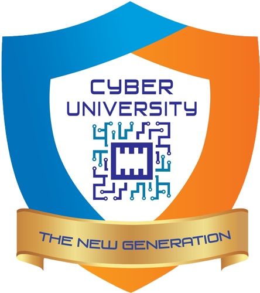

# E-Library - Universitas Siber Indonesia

Sistem Informasi Perpustakaan Digital modern dan terintegrasi untuk sivitas akademika **Universitas Siber Indonesia**, dibangun menggunakan **Laravel 13**, **Tailwind CSS**, **Alpine.js**, dan **MySQL**.



---

## 🌟 Fitur Utama

### 1. OPAC (Online Public Access Catalog)
* **Katalog Digital Terpadu**: Jelajahi ribuan judul buku, karya ilmiah, dan modul referensi.
* **Pencarian Cepat & Filter Multi-Kriteria**: Pencarian berdasarkan judul, pengarang, subjek/topik, penerbit, nomor ISBN, atau ketersediaan stok fisik.
* **Detail Buku Lengkap**: Informasi bibliografi lengkap, ketersediaan eksemplar real-time, nomor panggil/klasifikasi, dan buku terkait.
* **Buku Tamu Kunjungan Digital**: Formulir pencatatan kunjungan mandiri untuk mahasiswa, dosen, dan tamu umum.

### 2. Area Mandiri Anggota (Member Area)
* **Login Multi-Format**: Mahasiswa dapat login menggunakan ID Anggota (NIM) dengan sandi NIM, Tanggal Lahir (`YYYY-MM-DD`, `DDMMYYYY`, dsb.), atau PIN.
* **Kartu Anggota Digital**: Tampilan kartu anggota digital resmi berlogo Universitas Siber Indonesia.
* **Riwayat & Status Pinjaman**: Pantau buku yang sedang dipinjam, tanggal jatuh tempo, dan riwayat peminjaman buku.

### 3. Portal Administrasi Perpustakaan (Admin Panel)
* **Dashboard Statistik Real-Time**: Statistik total koleksi, eksemplar, anggota aktif, sirkulasi hari ini, dan pinjaman jatuh tempo.
* **Manajemen Bibliografi & Eksemplar**: Tambah, ubah, dan kelola nomor barcode eksemplar buku.
* **Sirkulasi Terpadu**:
  * Peminjaman buku dengan validasi tipe anggota & kuota.
  * Pengembalian kilat berbasis input barcode.
  * Perhitungan otomatis denda keterlambatan per hari.
* **Manajemen Anggota**: Registrasi anggota baru, upload foto profil, cetak kartu anggota (desain depan & belakang siap print).
* **Master Data**: Pengelolaan Pengarang, Penerbit, dan Topik/Subjek.

---

## 🛠️ Kebutuhan Sistem

* **PHP** >= 8.2
* **Composer** >= 2.x
* **MySQL** >= 8.0 atau **MariaDB** >= 10.4
* **Node.js** & **NPM** (opsional untuk build aset)
* **Web Server**: Apache / Nginx / Laragon / PHP Built-in Server

---

## 🚀 Panduan Instalasi

### 1. Clone Repository
```bash
git clone https://github.com/inawawi/elibrary-cu.git
cd elibrary-cu
```

### 2. Instal Dependensi PHP
```bash
composer install
```

### 3. Konfigurasi Environment
Salin template konfigurasi `.env.example` ke `.env`:
```bash
cp .env.example .env
```
Buka file `.env` dan sesuaikan koneksi database MySQL:
```env
DB_CONNECTION=mysql
DB_HOST=127.0.0.1
DB_PORT=3306
DB_DATABASE=elibrary
DB_USERNAME=root
DB_PASSWORD=
```

### 4. Generate Application Key
```bash
php artisan key:generate
```

### 5. Import Database
Import file backup database MySQL ke dalam database `elibrary`:
```bash
mysql -u root -p elibrary < path/to/database_backup.sql
```

### 6. Menjalankan Aplikasi
Jika menggunakan Laragon, pastikan host mengarah ke folder `public/`.
Atau jalankan server development Laravel:
```bash
php artisan serve
```
Buka peramban di: `http://localhost:8000`

---

## 🔒 Keamanan & Praktik Terbaik

* File rahasia `.env` **tidak pernah di-commit ke Git**.
* Sandi akun diamankan menggunakan enkripsi hashing Bcrypt.
* Seluruh formulir POST dilindungi dengan token CSRF.
* Proteksi SQL Injection menggunakan Laravel Eloquent Parameter Binding.

---

## 📄 Lisensi
Hak Cipta &copy; 2026 Perpustakaan Universitas Siber Indonesia.
